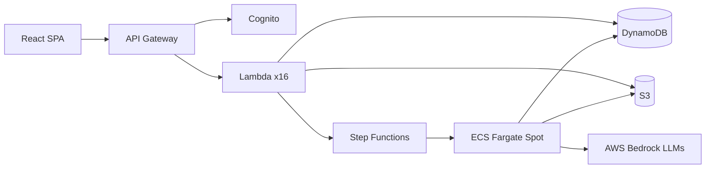

<div align="center" style="display: block;margin-left: auto;margin-right: auto;width: 70%;">
<h1>Plot Palette</h1>

<h4 align="center">
<a href="LICENSE"></a><a href="https://aws.amazon.com/bedrock/"></a><a href="https://aws.amazon.com/sam/"></a><a href="https://react.dev/"></a><a href="https://www.python.org/downloads/"></a><a href="https://nodejs.org/"></a>
</h4>
<p align="center">
  <p align="center"><b>Production-Ready Serverless Synthetic Data Generator<br> <a href="https://huggingface.co/datasets/Hatman/plot-palette-100k"> Plot Palette Dataset » </a> </b> </p>
</p>
<h1 align="center">
  
</h1>
<p>Generate synthetic training data at scale using AWS Bedrock foundation models. Leverage ECS Fargate Spot instances for up to 70% cost savings with automatic checkpoint recovery. Configure jobs, upload seed data, and monitor progress through a modern React web interface.</p>
</div>

> This repo is in active development and will change often.

## Architecture



```text
├── frontend/   # React 19 SPA
├── backend/    # Lambda functions, ECS worker, infrastructure
└── tests/      # Backend test suites (unit, integration, e2e)
```

## Prerequisites

- **Node.js** v24 LTS (for frontend and scripts)
- **Python 3.13+** (for backend Lambda functions)
- **AWS CLI** configured with credentials (`aws configure`)
- **AWS SAM CLI** for serverless deployment

## Quick Start

```bash
npm install          # Install dependencies
npm run deploy       # Deploy backend to AWS
npm run dev          # Start frontend dev server
npm run check        # Run all lint and tests
```

## Deployment

```bash
npm run deploy
```

The deploy script prompts for configuration:

| Prompt      | Description                                       |
| ----------- | ------------------------------------------------- |
| Stack Name  | CloudFormation stack name (default: plot-palette)  |
| AWS Region  | Deployment region (default: us-east-1)             |
| Environment | development or production                          |

Defaults are saved to `.env.deploy` and shown in brackets on subsequent runs.

See [CONTRIBUTING.md](CONTRIBUTING.md) for development setup and PR process.

## License

MIT - See [LICENSE](LICENSE) for details.
