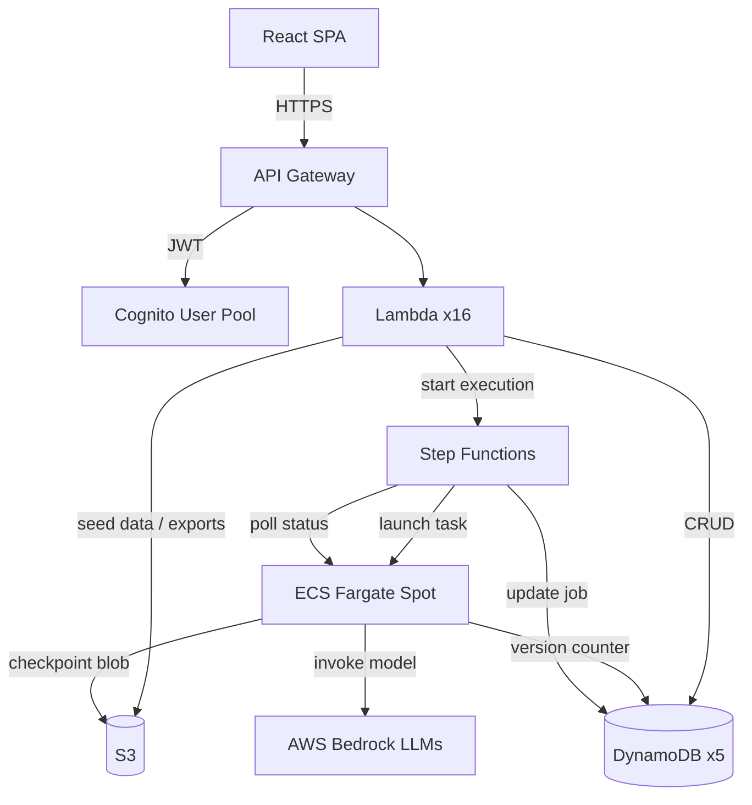

# Architecture

## System Overview

Plot Palette is a serverless synthetic data generation platform. Users define prompt templates and upload seed data, then the system orchestrates large-scale data generation using AWS Bedrock foundation models running on Fargate Spot instances.

## Job Lifecycle

1. **Create** -- User submits job config (template, seed data, budget, record count) via the React SPA. A Lambda handler writes the job to DynamoDB with status `QUEUED`.
2. **Queue** -- A second Lambda starts a Step Functions execution, passing the job ID.
3. **Launch** -- Step Functions launches an ECS Fargate Spot task with the job ID as an environment variable.
4. **Generate** -- The ECS worker loads the template and seed data, then loops: render prompt, call Bedrock, parse response, accumulate records. Every 50 records (configurable via `CHECKPOINT_INTERVAL`) the worker saves a checkpoint.
5. **Checkpoint** -- Checkpoint data is written to S3 (blob) with an ETag conditional write, and a version counter is atomically incremented in DynamoDB. On Spot interruption (SIGTERM), the worker saves a final checkpoint within 120 seconds.
6. **Resume** -- If the task is interrupted and restarted, the worker loads the last checkpoint from S3, verifies the version in DynamoDB, and resumes from `records_generated`.
7. **Export** -- Once all records are generated, the worker merges batch JSONL files into the requested format (JSONL, CSV, or Parquet) and writes the export to S3.
8. **Complete** -- Step Functions updates the job status to `COMPLETED`. The user downloads the export via a pre-signed S3 URL.

## Design Decisions

**DynamoDB (not RDS)** -- Pay-per-request billing matches bursty Lambda access patterns. No connection pool management. Single-digit millisecond reads for dashboard polling. Five tables keep partition keys simple and hot-key-free.

**Fargate Spot (not Lambda)** -- Generation jobs run 10-60 minutes with large memory footprints (seed data + batch buffers). Lambda's 15-minute timeout and 10 GB memory cap are insufficient. Fargate Spot provides up to 70% cost savings over on-demand, with a 120-second interruption notice that the checkpoint system handles.

**Checkpoint recovery (S3 + DynamoDB)** -- Dual-layer concurrency control prevents data loss on Spot interruptions. S3 stores the checkpoint blob with ETag-based conditional writes (optimistic locking at the storage layer). DynamoDB stores a version counter with conditional updates (optimistic locking at the metadata layer). On conflict, the worker reloads, merges using `max(records_generated)`, and retries with exponential backoff (up to 3 attempts).

**Step Functions (not direct ECS)** -- Decouples job lifecycle from worker execution. Step Functions handles task launch, polling, timeout, and status transitions. The worker only generates data and checkpoints -- it does not manage its own lifecycle.

**Tiered model pricing** -- Three cost tiers map to Bedrock models: tier-1 (Llama 8B, cheapest), tier-2 (Llama 70B, balanced), tier-3 (Claude 3.5 Sonnet, premium). Users select quality vs. cost in template steps.

## Database Schema

| Table | Partition Key | Sort Key | GSI | Purpose |
|-------|--------------|----------|-----|---------|
| Jobs | `job_id` (S) | -- | `user_id` + `created_at` | Job metadata, status, config |
| Queue | `status` (S) | `job_id_timestamp` (S) | -- | Status-based job queue |
| Templates | `template_id` (S) | `version` (N) | `user_id` | Prompt template definitions |
| CostTracking | `job_id` (S) | `timestamp` (S) | -- | Per-job cost events (TTL-enabled) |
| CheckpointMetadata | `job_id` (S) | -- | -- | Version counter for checkpoint concurrency |
