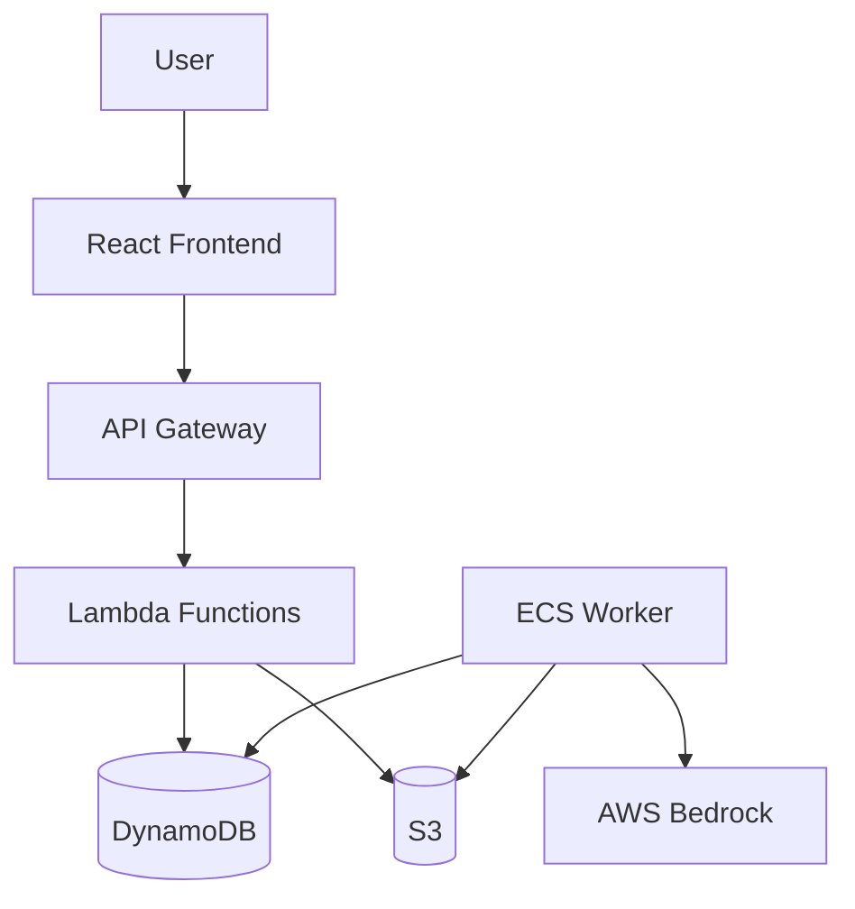

# Phase 9: Documentation & Production Deployment

## Phase Goal

Create comprehensive documentation, finalize production deployment, and prepare the system for public release. By the end of this phase, Plot Palette is production-ready with complete user and developer documentation.

**Success Criteria:**
- User guide with screenshots
- API documentation
- Architecture documentation
- Deployment guide
- Troubleshooting guide
- Contributing guide
- Production deployment complete
- Monitoring and alerting configured
- Security hardening complete

**Estimated Tokens:** ~45,000

---

## Prerequisites

- **Phases 1-8** completed
- All tests passing
- System deployed and stable

---

## Task 1: User Documentation

### Goal

Create comprehensive user-facing documentation with screenshots and tutorials.

### Files to Create

- `docs/user-guide/README.md` - Getting started guide
- `docs/user-guide/first-job.md` - Creating your first job
- `docs/user-guide/templates.md` - Template guide with examples
- `docs/user-guide/cost-optimization.md` - Cost saving tips
- `docs/user-guide/faq.md` - Frequently asked questions
- `docs/user-guide/screenshots/` - Screenshot directory

### Prerequisites

- Frontend deployed and accessible
- Sample templates available
- Test account for screenshots

### Implementation Steps

1. **Getting Started Guide** - Cover:
   - Account signup and verification
   - Login and dashboard overview
   - Navigation and main features
   - Basic terminology (jobs, templates, seed data)

2. **Creating Your First Job** - Step-by-step walkthrough:
   - Select a template (or create new)
   - Upload seed data CSV
   - Set budget limit
   - Submit job
   - Monitor progress
   - Download results
   - Include screenshots for each step

3. **Template Guide** - Explain:
   - What are templates
   - Template syntax (Jinja2 basics)
   - Using variables from seed data
   - Custom filters (capitalize, pluralize, etc.)
   - Conditional logic
   - Best practices (clear prompts, specific instructions)
   - Example templates for common use cases

4. **Cost Optimization Tips:**
   - Choose cheaper models for simple tasks
   - Use questions sparingly
   - Set appropriate budget limits
   - Batch similar jobs
   - Estimate costs before running

5. **FAQ** - Answer common questions:
   - How much does it cost?
   - What models are available?
   - How do I cancel a job?
   - What export formats are supported?
   - How long are results stored?
   - What's the maximum job size?

### Verification Checklist

- [ ] All guides written and tested
- [ ] Screenshots captured and annotated
- [ ] Links between docs working
- [ ] Example templates provided
- [ ] FAQ covers common issues
- [ ] Table of contents included

### Testing Instructions

- Follow each guide step-by-step
- Verify screenshots match current UI
- Test all example templates
- Check links work
- Get feedback from new user

### Commit Message Template

```
docs(user): add comprehensive user documentation

- Create getting started guide with screenshots
- Write first job tutorial with step-by-step instructions
- Document template syntax and examples
- Add cost optimization tips
- Create FAQ for common questions

Author: HatmanStack <82614182+HatmanStack@users.noreply.github.com>
```

**Estimated Tokens:** ~8,000

---

## Task 2: API Documentation

### Goal

Generate comprehensive API reference documentation with OpenAPI/Swagger.

### Files to Create

- `docs/api/openapi.yaml` - OpenAPI 3.0 specification
- `docs/api/README.md` - API overview and authentication
- `docs/api/examples/` - Request/response examples

### Prerequisites

- All API endpoints implemented (Phase 3)
- Understanding of OpenAPI specification
- Swagger UI or ReDoc for rendering

### Implementation Steps

1. **Create OpenAPI specification** - Document all endpoints:
   ```yaml
   openapi: 3.0.0
   info:
     title: Plot Palette API
     version: 1.0.0
     description: Synthetic data generation API

   servers:
     - url: https://api.plotpalette.com

   components:
     securitySchemes:
       BearerAuth:
         type: http
         scheme: bearer
         bearerFormat: JWT
   ```

2. **Document authentication:**
   - POST /auth/signup - User registration
   - POST /auth/login - Get JWT token
   - Include example requests/responses

3. **Document job endpoints:**
   - POST /jobs - Create job
   - GET /jobs - List jobs
   - GET /jobs/{id} - Get job details
   - DELETE /jobs/{id} - Delete job
   - Include all parameters, request bodies, responses

4. **Document template endpoints:**
   - POST /templates - Create template
   - GET /templates - List templates
   - PUT /templates/{id} - Update template
   - POST /templates/{id}/test - Test template

5. **Document error responses:**
   - 400 Bad Request - Invalid input
   - 401 Unauthorized - Missing/invalid token
   - 403 Forbidden - Insufficient permissions
   - 404 Not Found - Resource not found
   - 500 Internal Server Error - Server error

6. **Set up Swagger UI:**
   - Deploy static Swagger UI
   - Link to OpenAPI spec
   - Enable "Try it out" functionality

### Verification Checklist

- [ ] All endpoints documented
- [ ] Request/response examples included
- [ ] Error codes documented
- [ ] Authentication explained
- [ ] Swagger UI deployed
- [ ] Examples tested and working

### Testing Instructions

```bash
# Validate OpenAPI spec
npx @redocly/cli lint docs/api/openapi.yaml

# Generate HTML docs
npx @redocly/cli build-docs docs/api/openapi.yaml

# Deploy Swagger UI
# Upload to S3 or integrate with Amplify
```

### Commit Message Template

```
docs(api): add OpenAPI specification and API reference

- Create OpenAPI 3.0 specification for all endpoints
- Document authentication and authorization
- Add request/response examples for all endpoints
- Document error codes and responses
- Deploy Swagger UI for interactive documentation

Author: HatmanStack <82614182+HatmanStack@users.noreply.github.com>
```

**Estimated Tokens:** ~7,000

---

## Task 3: Architecture Documentation

### Goal

Document system architecture with diagrams for developers and operators.

### Files to Create

- `docs/architecture/README.md` - Architecture overview
- `docs/architecture/aws-infrastructure.md` - AWS services and connections
- `docs/architecture/data-flow.md` - Data flow through system
- `docs/architecture/diagrams/` - Diagram files

### Prerequisites

- System deployed and working
- Understanding of all components
- Diagram tool (draw.io, Lucidchart, or code-based like Mermaid)

### Implementation Steps

1. **System Architecture Diagram** - Show high-level components:
   - User → Amplify Frontend
   - Frontend → API Gateway → Lambda
   - Lambda → DynamoDB, S3
   - ECS Worker → Bedrock
   - Use boxes and arrows to show relationships

2. **AWS Infrastructure Diagram** - Detailed AWS view:
   - VPC with subnets
   - All AWS services (Cognito, API Gateway, Lambda, ECS, DynamoDB, S3, Bedrock)
   - Security groups and IAM roles
   - Data stores and queues

3. **Data Flow Diagrams** - Show data movement:
   - Job creation flow: User → API → DynamoDB → Worker → Bedrock → S3
   - Authentication flow: User → Cognito → JWT → API Gateway
   - Checkpoint flow: Worker → S3 (ETag) → Resume

4. **Sequence Diagrams** - Show key interactions:
   - Job submission and processing
   - Worker checkpoint save/restore
   - Budget enforcement
   - Spot interruption handling

**Example Mermaid diagram:**


5. **Write architecture documentation:**
   - Explain design decisions (refer to Phase 0 ADRs)
   - Describe component responsibilities
   - Document scaling strategy
   - Explain cost optimization choices

### Verification Checklist

- [ ] All diagrams created and clear
- [ ] Architecture documentation complete
- [ ] Design decisions explained
- [ ] Component relationships documented
- [ ] Diagrams match deployed system

### Testing Instructions

- Review diagrams with team
- Verify accuracy against deployed infrastructure
- Ensure diagrams are up-to-date
- Check all components mentioned

### Commit Message Template

```
docs(architecture): add system architecture documentation and diagrams

- Create high-level system architecture diagram
- Document AWS infrastructure with detailed diagram
- Add data flow diagrams for key workflows
- Create sequence diagrams for critical interactions
- Explain design decisions and component relationships

Author: HatmanStack <82614182+HatmanStack@users.noreply.github.com>
```

**Estimated Tokens:** ~6,000

---

## Task 4: Production Hardening

### Goal

Implement security best practices and performance optimizations for production deployment.

### Files to Create

- `infrastructure/cloudformation/waf-stack.yaml` - AWS WAF rules
- `infrastructure/cloudformation/backup-stack.yaml` - AWS Backup configuration
- `docs/security/security-checklist.md` - Security audit checklist

### Prerequisites

- System deployed to production
- Understanding of AWS WAF and security best practices
- AWS Backup service access

### Implementation Steps

1. **Enable AWS WAF on API Gateway:**
   - Create WAF WebACL with rules:
     - Rate limiting (1000 requests per 5 minutes per IP)
     - Block common SQL injection patterns
     - Block XSS attempts
     - Geo-blocking (optional, if needed)
   - Associate with API Gateway
   - Monitor blocked requests in CloudWatch

2. **Configure DynamoDB backups:**
   - Enable Point-in-Time Recovery (PITR) on all tables
   - Create AWS Backup plan:
     - Daily backups at 2 AM UTC
     - Retention: 7 days
     - Cross-region backup to secondary region (optional)

3. **Implement API rate limiting:**
   - Use API Gateway throttling settings
   - Per-user rate limits: 100 requests/minute
   - Burst: 200 requests
   - Return 429 Too Many Requests when exceeded

4. **Security hardening:**
   - Enable S3 bucket encryption (AES-256)
   - Enable S3 versioning on all buckets
   - Block public access on all S3 buckets
   - Enable CloudTrail for audit logging
   - Enable VPC Flow Logs
   - Review IAM policies (least privilege)
   - Enable MFA for admin accounts

5. **Performance optimizations:**
   - Enable API Gateway caching (optional, for GET endpoints)
   - Optimize Lambda memory allocation
   - Enable DynamoDB auto-scaling
   - Set up CloudFront for Amplify (if not auto-enabled)

### Verification Checklist

- [ ] WAF enabled and rules active
- [ ] DynamoDB PITR enabled
- [ ] AWS Backup configured
- [ ] Rate limiting enforced
- [ ] S3 encryption enabled
- [ ] CloudTrail logging enabled
- [ ] IAM policies reviewed
- [ ] Security audit checklist completed

### Testing Instructions

```bash
# Test rate limiting
for i in {1..1500}; do curl -X GET $API_ENDPOINT/jobs; done
# Should start returning 429 after limit

# Verify backups
aws backup list-backup-plans
aws dynamodb describe-continuous-backups --table-name JobsTable

# Check WAF
aws wafv2 list-web-acls --scope REGIONAL --region us-east-1

# Verify encryption
aws s3api get-bucket-encryption --bucket plot-palette-data
```

### Commit Message Template

```
feat(security): add production hardening and security controls

- Enable AWS WAF with rate limiting and injection protection
- Configure DynamoDB PITR and AWS Backup
- Implement API rate limiting per user
- Enable S3 encryption and versioning
- Add CloudTrail and VPC Flow Logs
- Review and tighten IAM policies

Author: HatmanStack <82614182+HatmanStack@users.noreply.github.com>
```

**Estimated Tokens:** ~8,000

---

## Task 5: Monitoring & Alerting

### Goal

Set up comprehensive monitoring with CloudWatch dashboards and SNS alerts.

### Files to Create

- `infrastructure/cloudformation/monitoring-stack.yaml` - CloudWatch alarms and dashboards
- `infrastructure/cloudformation/sns-stack.yaml` - SNS topics and subscriptions
- `docs/operations/runbook.md` - Operational runbook

### Prerequisites

- System deployed to production
- Understanding of CloudWatch metrics and alarms
- Email for notifications

### Implementation Steps

1. **Create CloudWatch Dashboard:**
   - API metrics: Request count, latency (p50, p95, p99), error rate
   - Lambda metrics: Invocations, errors, duration, concurrent executions
   - ECS metrics: Task count, CPU, memory, task failures
   - DynamoDB metrics: Read/write capacity, throttles
   - Bedrock metrics: Requests, tokens, throttles, costs
   - S3 metrics: Bucket size, requests

2. **Configure CloudWatch Alarms:**

**API Alarms:**
- High error rate (>5% for 5 minutes)
- High latency (p95 >1s for 5 minutes)
- Low availability (<99% for 10 minutes)

**Worker Alarms:**
- ECS task failures (>3 in 5 minutes)
- High memory usage (>90% for 10 minutes)
- Bedrock throttling (>10 in 5 minutes)

**Cost Alarms:**
- Daily spend exceeds $50
- Bedrock costs spike (>$20 in 1 hour)

**Database Alarms:**
- DynamoDB throttling events
- Read capacity >80%
- Write capacity >80%

3. **Set up SNS topics:**
   - Critical alerts → Email + SMS
   - Warning alerts → Email only
   - Info alerts → Email daily digest

4. **Create operational runbook:**
   - How to respond to each alarm
   - Escalation procedures
   - Common issues and fixes
   - Dashboard links

### Verification Checklist

- [ ] CloudWatch Dashboard created
- [ ] All critical alarms configured
- [ ] SNS topics and subscriptions active
- [ ] Test alerts sent successfully
- [ ] Runbook documented
- [ ] Team trained on alerts

### Testing Instructions

```bash
# Trigger test alarm
aws cloudwatch set-alarm-state \
    --alarm-name HighAPIErrorRate \
    --state-value ALARM \
    --state-reason "Testing alert"

# View dashboard
# Open CloudWatch console → Dashboards → PlotPaletteProd

# Check SNS subscriptions
aws sns list-subscriptions-by-topic --topic-arn $TOPIC_ARN
```

### Commit Message Template

```
feat(monitoring): add CloudWatch dashboards and alerting

- Create comprehensive CloudWatch dashboard
- Configure alarms for API, worker, and cost metrics
- Set up SNS topics for critical, warning, info alerts
- Add operational runbook for incident response
- Test all alarms and notifications

Author: HatmanStack <82614182+HatmanStack@users.noreply.github.com>
```

**Estimated Tokens:** ~7,000

---

## Task 6: Final Production Deployment

### Goal

Execute production deployment with verification and smoke tests.

### Files to Create

- `infrastructure/scripts/deploy-production.sh` - Production deployment script
- `tests/smoke/smoke-tests.sh` - Post-deployment smoke tests
- `docs/operations/deployment-checklist.md` - Pre/post deployment checklist

### Prerequisites

- All previous phases completed
- All tests passing
- Production AWS account ready
- DNS configured (if using custom domain)

### Implementation Steps

1. **Pre-deployment checklist:**
   - [ ] All tests passing (unit, integration, E2E)
   - [ ] Security hardening complete
   - [ ] Monitoring and alerts configured
   - [ ] Documentation complete
   - [ ] Backup strategy in place
   - [ ] Rollback plan ready
   - [ ] Team notified of deployment window

2. **Deploy to production:**
   ```bash
   # Deploy master stack
   ./infrastructure/scripts/deploy.sh \
       --create \
       --environment production \
       --region us-east-1

   # Wait for completion (~15-20 minutes)
   # Monitor CloudFormation events
   ```

3. **Load sample templates:**
   - Create system templates for common use cases
   - Upload to DynamoDB Templates table
   - Examples: Customer reviews, product descriptions, user personas

4. **Create admin user:**
   - Sign up via frontend
   - Verify email
   - Add to admin group in Cognito (if needed)

5. **Run smoke tests:**
   ```bash
   # Basic health checks
   curl -f $API_ENDPOINT/health

   # Create test job
   # Upload seed data
   # Monitor job completion
   # Download export
   # Verify data quality
   ```

6. **Post-deployment verification:**
   - [ ] All stack outputs available
   - [ ] Frontend accessible
   - [ ] API responding
   - [ ] Authentication working
   - [ ] Job creation and processing working
   - [ ] Monitoring dashboard showing data
   - [ ] Alerts configured
   - [ ] Sample templates loaded

7. **Update documentation:**
   - Update deployment guide with production URL
   - Add production credentials to secure storage
   - Update team wiki with production info

### Verification Checklist

- [ ] CloudFormation stack deployed successfully
- [ ] All nested stacks healthy
- [ ] Smoke tests passed
- [ ] Admin user created
- [ ] Sample templates loaded
- [ ] Monitoring active
- [ ] Documentation updated
- [ ] Team notified of go-live

### Testing Instructions

```bash
# Run smoke tests
./tests/smoke/smoke-tests.sh $PRODUCTION_URL

# Verify outputs
aws cloudformation describe-stacks \
    --stack-name plot-palette-production \
    --query 'Stacks[0].Outputs'

# Check all services healthy
aws ecs describe-clusters --clusters plot-palette-production
aws dynamodb describe-table --table-name JobsTable-prod
```

### Commit Message Template

```
chore(deploy): deploy Plot Palette to production

- Deploy master CloudFormation stack to production
- Load system template library
- Create admin user and verify access
- Run smoke tests and verify all systems operational
- Update documentation with production details

Author: HatmanStack <82614182+HatmanStack@users.noreply.github.com>
```

**Estimated Tokens:** ~6,000

---

## Phase 9 Verification

**Success Criteria:**

- [ ] User documentation complete with screenshots
- [ ] API documentation with OpenAPI spec deployed
- [ ] Architecture diagrams created and accurate
- [ ] Security hardening implemented (WAF, backups, encryption)
- [ ] Monitoring dashboards and alarms configured
- [ ] Production deployment successful
- [ ] Smoke tests passing
- [ ] All stack outputs available
- [ ] Team trained and notified

**Estimated Total Tokens:** ~42,000

---

## Project Complete!

Congratulations! Plot Palette is now production-ready. The complete system includes:

- ✅ Serverless AWS architecture
- ✅ ECS Fargate Spot workers for cost-effective generation
- ✅ AWS Bedrock integration
- ✅ Advanced prompt template engine
- ✅ React frontend with authentication
- ✅ Real-time job monitoring
- ✅ Multi-format export
- ✅ Budget enforcement
- ✅ Comprehensive testing
- ✅ Complete documentation

**Next Steps:**
- Monitor usage and costs
- Gather user feedback
- Iterate on features
- Optimize performance
- Add new template types

---

**Navigation:**
- [← Previous: Phase 8](./Phase-8.md)
- [← Back to README](./README.md)
